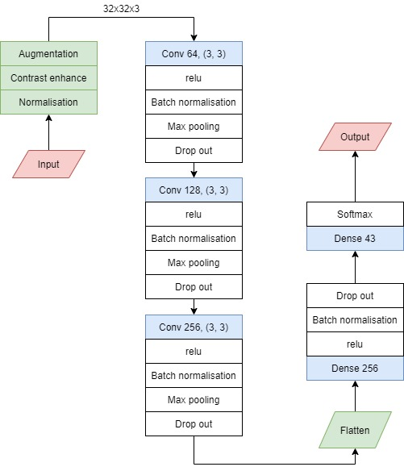
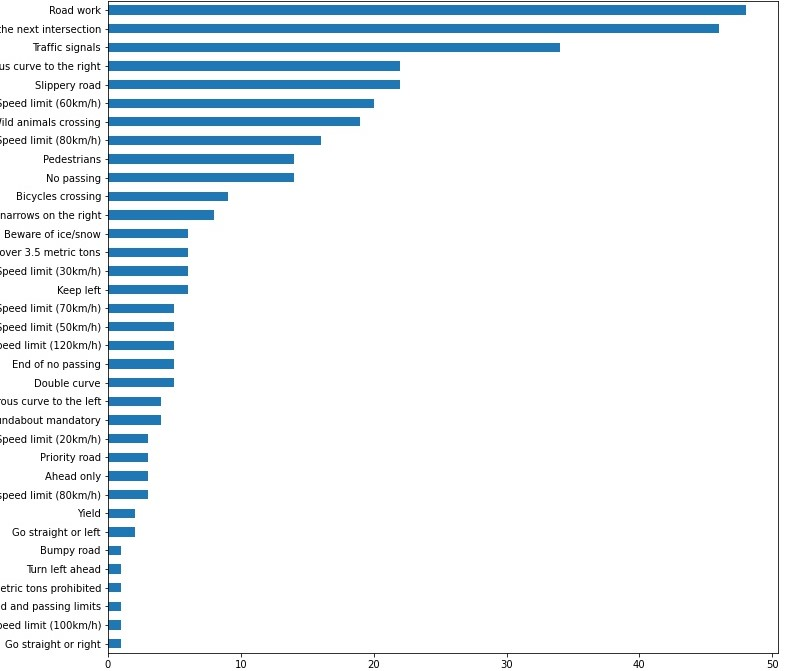

# Sign-Traffic-recognition

Sign recognition is a two part process. First process is to recognise there is a traffic sign on the road, and then localise it. The second is to find out which sign it is. This post handle the second process. The final model accuracy is 97.24% on test dataset.

Model architecture of the model is as shown below, and it is saved in model.py.

The 'Sign recognition training model.ipynb' file is to train the model. The trained model is saved inside
'Predction_model' file is used trained model on new images to predict signs. The final accuracy is 97.24%. By analysing the error, most of false predicted images are in very bad quality. It is hard, even for human error to find out which sign it is. It is notable that 'Road Work' and 'Right of way at next intersection' signs are the most false predicted signs, as they are account for more than 25% of error. Obtaining more training images in these sign categories, could improve the model more.

